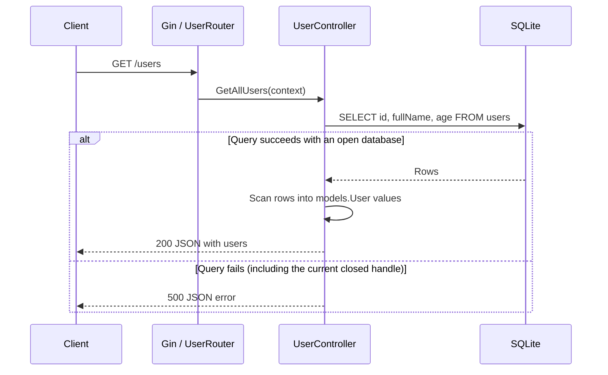

# Go MVC with Gin and SQLite

A small Go HTTP API that demonstrates how to organize user data, request handlers, and routes using an MVC-style structure. It uses Gin for HTTP routing and `database/sql` with the `github.com/mattn/go-sqlite3` driver for SQLite storage.

The application listens on port **5001** and defines two endpoints: `GET /health` and `GET /users`.

## How MVC applies here

MVC stands for **Model–View–Controller**. Each part has a different responsibility:

| Part | In this project | Responsibility |
| --- | --- | --- |
| Model | `models/user.go` | Defines the `User` data structure. |
| View | JSON written with `context.JSON(...)` | Presents results to API clients. There are no HTML templates or separate view files. |
| Controller | `controllers/user.handler.go` | Handles a request, queries users, and writes the HTTP response. |

Routes connect URLs to controllers. Database infrastructure opens the SQLite database and creates its table. The controller currently contains SQL directly; this is a simple MVC example without a separate service layer.

## Project structure

```text
.
├── main.go                       # Initializes the database and starts Gin
├── controllers/
│   └── user.handler.go           # UserController and GetAllUsers handler
├── models/
│   └── user.go                   # User fields and JSON names
├── router/
│   ├── router.go                 # Registers health and user routes
│   └── user.router.go            # Connects GET /users to its controller
├── infra/
│   ├── db.go                     # SQLite initialization and table creation
│   └── db/
│       └── user.repository.go    # Unused repository interface placeholder
├── test/
│   └── user.http                 # Manual GET /users request
├── demo.db                       # SQLite database file
├── go.mod                        # Module, Go version, and dependencies
└── go.sum                        # Dependency checksums
```

## Startup and dependency wiring

`main.go` assembles the application:

1. Creates an `infra.MyDB` value and calls `InitDB()`.
2. `InitDB()` opens `./demo.db` and runs `CREATE TABLE IF NOT EXISTS users`.
3. Creates a Gin engine with `gin.Default()`, which includes logging and recovery middleware.
4. Passes the engine and database handle to `router.RegisterRouter(...)`.
5. Registers `/health`, constructs a `UserController`, and connects `/users` through `UserRouter`.
6. Starts the HTTP server on `:5001`.

Passing `*sql.DB` into `NewUserController(db)` is constructor-based dependency injection: the controller receives its database handle from the startup code.

**Current limitation:** `InitDB()` contains `defer db.Close()`. That closes the database handle when initialization returns, before the server handles requests. The controller therefore receives a closed handle, and `/users` returns HTTP 500. The handle needs to remain open for the server's lifetime, with cleanup owned by the startup/shutdown code.

## How a user request flows



`GetAllUsers` executes the query, scans each row into a `models.User`, appends it to a slice, and serializes that slice as JSON. `infra/db/user.repository.go` declares a `UserRepository` interface with a `findAll()` method, but no implementation or controller integration exists yet.

## User model and database table

The table is created with this schema:

```sql
CREATE TABLE IF NOT EXISTS users (
    id INTEGER PRIMARY KEY AUTOINCREMENT,
    fullName TEXT,
    age INT
);
```

The Go model maps database values to the response:

| Database column | Go field | Go type | JSON key |
| --- | --- | --- | --- |
| `id` | `ID` | `string` | `user_id` |
| `fullName` | `FullName` | `string` | `full_name` |
| `age` | `Age` | `int` | `Age` |

Although SQLite stores `id` as an integer, the model receives it as a string. `Age` has no JSON tag, so its JSON key retains the capital `A`. Initialization creates the table but does not insert sample users.

## Run locally

Requirements:

- A Go toolchain compatible with the `go 1.26.6` directive in `go.mod`.
- CGO enabled and a C compiler available for `github.com/mattn/go-sqlite3`.

From the project root:

```bash
go mod download
CGO_ENABLED=1 go run .
```

The database path is relative to the working directory, so run from the project root to use the included `demo.db`. The port and database path are hardcoded; there is no environment configuration.

In another terminal:

```bash
curl http://localhost:5001/health
curl http://localhost:5001/users
```

You can also execute `test/user.http` with an editor extension that supports HTTP request files.

## API responses

### `GET /health`

Returns HTTP 200 with the following body (the trailing space in `"ok "` is present in the code):

```json
{"message":"ok "}
```

This endpoint does not check database connectivity.

### `GET /users`

With the current database lifetime issue, the query fails and returns HTTP 500:

```json
{"message":"Failed to fetch user"}
```

After correcting the database lifetime, a successful response would return HTTP 200. For example, if the database contains this user:

```json
{
  "message": "Get all users successfully !",
  "users": [
    {"user_id": "1", "full_name": "Jane Doe", "Age": 25}
  ]
}
```

An empty result currently serializes as `"users": null` because the slice starts as `nil`. The query does not specify an ordering or pagination. There are no create, update, or delete endpoints.

## Other implementation limitations

- The controller does not explicitly close query rows or check `rows.Err()` after iteration.
- A row scanning error writes an error response but does not return, so processing continues and can attempt another response.
- Database initialization logs errors without returning them to `main`, and `sql.Open` alone does not verify connectivity.
- `test/user.http` is a manual request example; the project contains no automated Go test files.

These details describe the current implementation and are useful next steps when extending the example.
